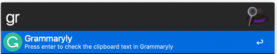

# Description
Open `https://app.grammarly.com/` in your Chrome browser, and check it automatically.

## How to use?

Type `gr` in the alfred, it will open the Grammarly website and check the text from clipboard automatically.

##  License
[WTFPL](http://www.wtfpl.net/about/), of course.